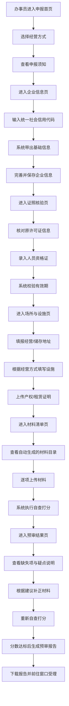

## 1. 产品概述

危化品经营企业换证预审平台，面向危化品经营企业办事员，解决换证材料反复退回、政策口径难掌握的痛点。通过智能化预审、材料清单自动生成、到期提醒等功能，帮助企业在正式申报前完成自查，提高窗口受理一次通过率。

- 目标用户：危化品经营（汽油、柴油、仓储、票据贸易等）企业的办事人员、安全管理人员
- 产品价值：减少材料往返退回次数、降低政策理解成本、缩短换证办理周期、保留修改痕迹便于内部复核

---

## 2. 核心功能

### 2.1 用户角色

| 角色 | 注册方式 | 核心权限 |
|------|----------|----------|
| 企业办事员 | 无需注册，直接使用 | 信息填报、材料上传、自查打分、预审报告生成、历史版本查看 |

### 2.2 功能模块

1. **申报首页**：经营方式选择、申报须知、办事进度向导、快捷入口
2. **企业信息**：统一社会信用代码读取带出、基础信息填报、联系人信息
3. **证照核验**：原许可证信息核对、主要负责人/安全员资格证到期提醒、变更记录
4. **场所与设施**：经营地址与储存地址一致性校验、产权/租赁证明核对、设施差异化填报
5. **材料清单**：按经营方式自动生成材料目录、缺失项提示、上传前自查打分、修改痕迹
6. **预审结果**：缺失项清单、疑点说明、修改建议、预审报告生成与下载

### 2.3 页面详情

| 页面名称 | 模块名称 | 功能描述 |
|----------|----------|----------|
| 申报首页 | 顶部导航 | 平台Logo、当前申报进度、帮助中心入口 |
| 申报首页 | 经营方式选择 | 汽油零售、柴油零售、仓储经营、票据贸易、其他经营方式单选卡片 |
| 申报首页 | 申报须知 | 政策要点、办理时限、常见问题折叠面板 |
| 申报首页 | 流程向导 | 6步流程图，高亮当前步骤，可点击跳转 |
| 申报首页 | 快捷入口 | 上次申报记录、预审报告历史、帮助文档 |
| 企业信息 | 统一社会信用代码输入 | 18位代码校验、模拟读取企业基础信息 |
| 企业信息 | 基础信息带出 | 企业名称、法定代表人、成立日期、注册地址自动填充 |
| 企业信息 | 可编辑信息区 | 经营地址、联系人、联系电话、电子邮箱编辑 |
| 企业信息 | 信息一致性提示 | 注册地址与经营地址差异提醒 |
| 证照核验 | 原许可证信息 | 证号、有效期、许可范围自动带出与校验 |
| 证照核验 | 有效期检查 | 距离到期不足3个月/6个月红色/黄色预警 |
| 证照核验 | 人员资格证 | 主要负责人、安全管理人员证书信息与到期提醒 |
| 证照核验 | 变更记录 | 许可范围变更、地址变更、法人变更历史追溯 |
| 场所与设施 | 经营地址 | 地址文本、产权类型（自有/租赁）、证明文件上传 |
| 场所与设施 | 储存地址 | 地址文本、储存能力、产权证明、与经营地址一致性校验 |
| 场所与设施 | 差异化填报 | 汽油（油罐/加油机）、柴油（储罐）、仓储（库房/储罐区）、票据（无实体） |
| 场所与设施 | 安全设施 | 消防器材、通风、报警装置、应急物资清单 |
| 材料清单 | 材料目录生成 | 根据经营方式动态显示应提交材料清单 |
| 材料清单 | 材料上传状态 | 已上传/待上传/不符合要求三态标记 |
| 材料清单 | 自查打分 | 按材料完整性、格式合规性、信息一致性自动计分 |
| 材料清单 | 修改痕迹 | 每次保存记录版本号、修改时间、修改内容对比 |
| 预审结果 | 缺失项清单 | 分类列出缺失材料及补交说明 |
| 预审结果 | 疑点说明 | 标注存疑信息及核实建议 |
| 预审结果 | 修改建议 | 针对不合格项的具体整改指引 |
| 预审结果 | 预审报告 | 生成符合窗口受理格式的PDF预览与下载 |
| 预审结果 | 历史记录 | 历次预审版本查看与对比 |

---

## 3. 核心流程

办事员登录平台 → 选择经营方式进入申报向导 → 输入统一社会信用代码读取企业基础信息 → 逐页完善证照、场所、材料信息 → 系统实时校验并标注问题 → 完成材料上传后执行自查打分 → 查看预审结果并根据修改建议补正 → 生成预审报告用于窗口受理。

---

## 4. 用户界面设计

### 4.1 设计风格

- **主色调**：政务深蓝 `#1E3A8A`，体现权威、专业、可信
- **辅助色**：警示红 `#DC2626`（到期/缺失）、提醒黄 `#D97706`（临期/待补充）、通过绿 `#059669`（合规）
- **中性色**：浅灰背景 `#F1F5F9`、深灰文字 `#0F172A`、边框 `#CBD5E1`
- **按钮样式**：圆角 6px，主按钮深蓝填充，次按钮描边式，悬停微亮
- **字体**：标题用思源宋体（庄重感），正文用思源黑体（可读性），数字用等宽字体
- **布局风格**：顶部固定导航 + 左侧步骤向导 + 右侧主内容卡片式布局
- **图标风格**：线性图标，统一 24px 网格，政务风格无花哨装饰
- **视觉纹理**：标题栏微妙渐变、卡片投影分层、输入框聚焦蓝色光晕

### 4.2 页面设计概览

| 页面名称 | 模块名称 | UI 元素 |
|----------|----------|---------|
| 申报首页 | 经营方式卡片 | 大图标 + 标题 + 副标题，选中态深蓝边框 + 浅蓝背景 |
| 申报首页 | 流程向导 | 横向时间轴，已完成绿勾、进行中蓝圆、未完成灰圈 |
| 企业信息 | 信用代码输入 | 大号输入框，右侧"读取信息"按钮，加载动画 |
| 企业信息 | 信息表单 | 分组卡片，带出字段灰色禁用态，可编辑字段白色输入框 |
| 证照核验 | 有效期指示 | 进度条式倒计时，绿→黄→红渐变，到期日文字标注 |
| 证照核验 | 人员资格证 | 卡片列表，每张卡片显示姓名、证号、有效期、预警角标 |
| 场所与设施 | 差异化区域 | Tab 切换，根据经营方式显示对应设施表单 |
| 场所与设施 | 地址一致性校验 | 绿色/红色标签附右侧，点击查看差异详情 |
| 材料清单 | 目录列表 | 左侧树状分类，右侧材料卡片含上传按钮、状态徽章、预览缩略图 |
| 材料清单 | 自查打分 | 仪表盘式环形进度，分数 + 等级 + 建议文字 |
| 材料清单 | 修改痕迹 | 时间线样式，每次修改可展开对比（新增绿底、删除红底） |
| 预审结果 | 问题汇总 | 三色分类卡片（缺失/疑点/建议），每项含图标 + 说明 + 跳转按钮 |
| 预审结果 | 预审报告预览 | 模拟 A4 纸张，水印"预审专用"，页眉页脚政务样式 |

### 4.3 响应式设计

- **桌面优先**：最小宽度 1280px，主内容区 960px 居中
- **平板适配**：≥768px 时步骤向导折叠为顶部横向条
- **触摸优化**：按钮最小高度 44px，上传区域支持拖拽与点击双模式

---
