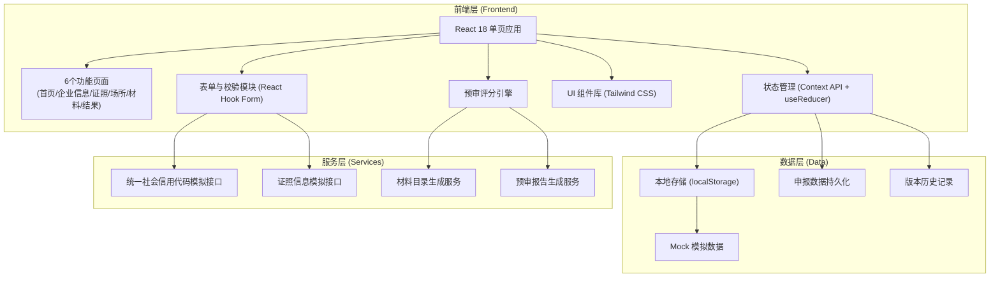

## 1. 架构设计



---

## 2. 技术说明

- **前端框架**：React@18 + React Router@6
- **构建工具**：Vite@5
- **样式方案**：TailwindCSS@3（原子化 CSS）+ CSS 变量主题
- **表单管理**：React Hook Form + Zod 校验
- **状态管理**：React Context API + useReducer（轻量级，无需 Redux）
- **图标**：Lucide React（线性图标，符合政务风格）
- **数据持久化**：localStorage 存储申报草稿与历史版本
- **Mock 数据**：内置模拟企业信息、证照数据、材料模板

---

## 3. 路由定义

| 路由路径 | 页面名称 | 说明 |
|----------|----------|------|
| `/` | 申报首页 | 经营方式选择、申报须知、流程向导 |
| `/enterprise` | 企业信息 | 统一社会信用代码读取、基础信息编辑 |
| `/license` | 证照核验 | 许可证核对、人员资格证到期提醒、变更记录 |
| `/premises` | 场所与设施 | 经营/储存地址、产权证明、差异化设施填报 |
| `/materials` | 材料清单 | 材料目录生成、上传、自查打分、修改痕迹 |
| `/result` | 预审结果 | 缺失项清单、疑点说明、预审报告生成下载 |

---

## 4. 数据模型

### 4.1 核心数据结构

```mermaid
erDiagram
    DECLARATION {
        string id PK "申报ID"
        string businessType "经营方式: gasoline/diesel/storage/bill/other"
        string status "状态: draft/submitted"
        number currentStep "当前步骤 1-6"
        number selfCheckScore "自查打分 0-100"
        string createdAt "创建时间"
        string updatedAt "更新时间"
    }

    ENTERPRISE {
        string declarationId FK "申报ID"
        string creditCode "统一社会信用代码"
        string name "企业名称"
        string legalPerson "法定代表人"
        string establishDate "成立日期"
        string registeredAddress "注册地址"
        string businessAddress "经营地址"
        string contactPerson "联系人"
        string contactPhone "联系电话"
        string email "电子邮箱"
    }

    LICENSE {
        string declarationId FK "申报ID"
        string licenseNumber "原许可证号"
        string validFrom "发证日期"
        string validTo "有效期至"
        string scope "许可范围"
        json changeRecords "变更记录数组"
    }

    PERSON_CERT {
        string id PK "证书ID"
        string declarationId FK "申报ID"
        string role "角色: 主要负责人/安全管理员"
        string name "姓名"
        string certNumber "证书编号"
        string validTo "有效期至"
    }

    PREMISES {
        string declarationId FK "申报ID"
        string businessAddress "经营地址"
        string businessPropertyType "经营场所产权: own/lease"
        string storageAddress "储存地址"
        string storageCapacity "储存能力"
        string storagePropertyType "储存场所产权"
        json facilities "设施清单"
        json safetyEquipments "安全设施清单"
    }

    MATERIAL {
        string id PK "材料ID"
        string declarationId FK "申报ID"
        string category "分类"
        string name "材料名称"
        string required "是否必填"
        string status "状态: pending/uploaded/invalid"
        string fileName "文件名"
        string remark "备注"
    }

    VERSION_HISTORY {
        string id PK "版本ID"
        string declarationId FK "申报ID"
        number version "版本号"
        string snapshot "数据快照 JSON"
        string changes "修改说明"
        string createdAt "创建时间"
    }

    PRECHECK_RESULT {
        string declarationId FK "申报ID"
        json missingItems "缺失项"
        json doubtItems "疑点项"
        json suggestions "修改建议"
        string reportUrl "预审报告"
    }

    DECLARATION ||--|| ENTERPRISE : has
    DECLARATION ||--|| LICENSE : has
    DECLARATION ||--o{ PERSON_CERT : has
    DECLARATION ||--|| PREMISES : has
    DECLARATION ||--o{ MATERIAL : has
    DECLARATION ||--o{ VERSION_HISTORY : has
    DECLARATION ||--|| PRECHECK_RESULT : has
```



### 4.2 TypeScript 类型定义

```typescript
// 经营方式枚举
type BusinessType = 'gasoline' | 'diesel' | 'storage' | 'bill' | 'other';

// 申报状态
type DeclarationStatus = 'draft' | 'submitted';

// 材料状态
type MaterialStatus = 'pending' | 'uploaded' | 'invalid';

// 预警级别
type AlertLevel = 'normal' | 'warning' | 'danger';

interface Declaration {
  id: string;
  businessType: BusinessType;
  status: DeclarationStatus;
  currentStep: number;
  selfCheckScore: number;
  createdAt: string;
  updatedAt: string;
}

interface Enterprise {
  declarationId: string;
  creditCode: string;
  name: string;
  legalPerson: string;
  establishDate: string;
  registeredAddress: string;
  businessAddress: string;
  contactPerson: string;
  contactPhone: string;
  email: string;
}

interface License {
  declarationId: string;
  licenseNumber: string;
  validFrom: string;
  validTo: string;
  scope: string;
  changeRecords: ChangeRecord[];
}

interface ChangeRecord {
  id: string;
  date: string;
  type: string;
  before: string;
  after: string;
}

interface PersonCert {
  id: string;
  declarationId: string;
  role: '主要负责人' | '安全管理员';
  name: string;
  certNumber: string;
  validTo: string;
}

interface Premises {
  declarationId: string;
  businessAddress: string;
  businessPropertyType: 'own' | 'lease';
  storageAddress: string;
  storageCapacity: string;
  storagePropertyType: 'own' | 'lease';
  facilities: Facility[];
  safetyEquipments: SafetyEquipment[];
}

interface Material {
  id: string;
  declarationId: string;
  category: string;
  name: string;
  required: boolean;
  status: MaterialStatus;
  fileName?: string;
  remark?: string;
}

interface VersionHistory {
  id: string;
  declarationId: string;
  version: number;
  snapshot: string;
  changes: string;
  createdAt: string;
}

interface PrecheckResult {
  declarationId: string;
  missingItems: PrecheckItem[];
  doubtItems: PrecheckItem[];
  suggestions: PrecheckItem[];
  reportUrl?: string;
}

interface PrecheckItem {
  id: string;
  level: AlertLevel;
  title: string;
  description: string;
  suggestion: string;
  relatedPage?: string;
}
```

---

## 5. 目录结构

```
src/
├── assets/              # 静态资源（字体、图标）
├── components/          # 通用组件
│   ├── layout/         # 布局组件（Header、Sidebar、Stepper）
│   ├── form/           # 表单组件（Input、Select、Upload、DatePicker）
│   └── ui/             # UI 组件（Card、Badge、Alert、Modal、Timeline）
├── context/            # React Context（申报状态、主题）
├── data/               # Mock 数据、材料模板
├── hooks/              # 自定义 Hooks（useDeclaration、usePrecheck、useMaterialList）
├── pages/              # 6 个页面组件
│   ├── Home.tsx
│   ├── Enterprise.tsx
│   ├── License.tsx
│   ├── Premises.tsx
│   ├── Materials.tsx
│   └── Result.tsx
├── router/             # 路由配置
├── services/           # 业务服务（预审引擎、材料目录、报告生成）
├── types/              # TypeScript 类型定义
├── utils/              # 工具函数（日期、校验、存储）
├── App.tsx
├── main.tsx
└── index.css           # Tailwind 入口 + 主题变量
```

---
